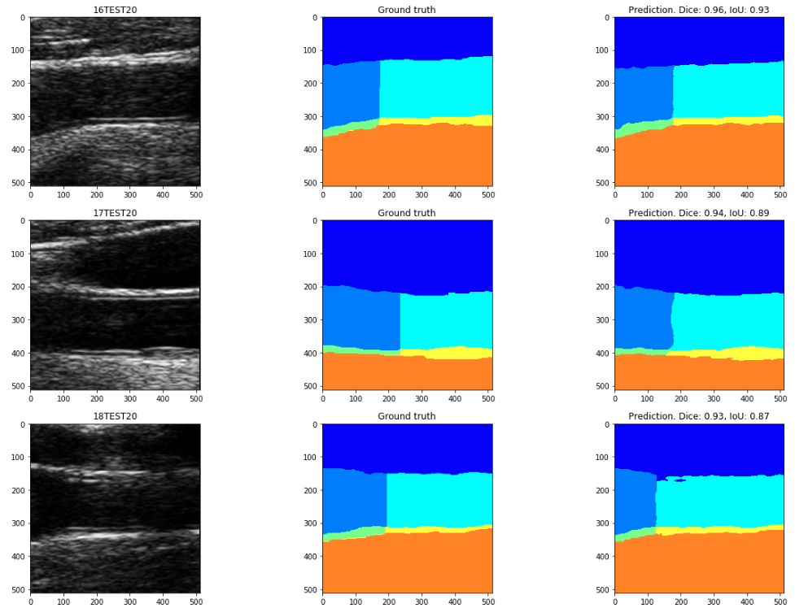
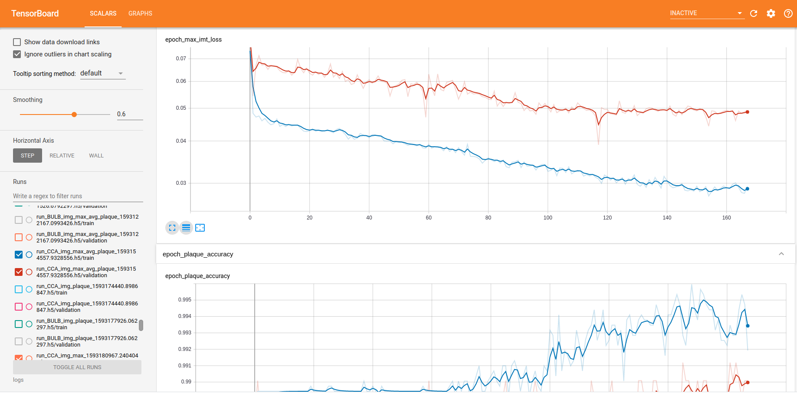

# Deep learning techniques for atherosclerotic plaque detection in the carotid artery

This repository contains the code to reproduce the results in "Deep learning techniques for atherosclerotic plaque detection in the carotid artery". It also provides an easy to use framework for future experiments.

## Setup
You can start cloning this repository to your system:
```
git clone https://github.com/gagolucasm/DL_CIMT_and_plaque_estimation
```

The code is programmed in [Python 3.6 64 bits](https://www.python.org/downloads/release/python-360/). To install all requiered libraries run:
```
pip install -r requirements.txt
```
Training times can be prohibitively long if you don't have a (high-end) Nvidia GPU, with driver version 418.x or higher. If you do, make sure that CUDA 10.1 and cuDNN >= 7.6 are installed.

This code was trained on the [REGICOR](https://regicor.cat/en/introduction/) database. It can be requested for academic purposes.

The database should be placed in the root of this repo, in a folder called `datasets`. Code has been provided to compare results with the ones in [Semantic segmentation with DenseNets for carotid artery ultrasound plaque segmentation and CIMT estimation](https://doi.org/10.1016/j.artmed.2019.101784), it can be requested to the authors. The directory should look as follows:
```

 |-- DL_CIMT_and_plaque_estimation
    |-- datasets
        |-- BULB
            |-- REGICOR_3000
            |-- TRAINTEST
        |-- CCA
            |-- REGICOR_4000
            |-- TRAINTEST
    |-- results_mdm_et_al
        |-- imts_postprT56_1cm.csv
        |-- imts_postprT67_BUnewGT_4L.csv
        |-- names__postprT67_BUnewGT_4L.csv
        |-- names_postprT56_1cm.csv
    |-- segmentation
    |-- __init__.py
    |-- config.py
    |-- ...
    |-- README.md
    |-- requirements.txt
 
```

## How to use

First of all, you need to train the segmentation model. This can be done by selecting the desired values in the [segmentation/config.py](segmentation/config.py) file and then running:
```
python3 train_semantic_segmentation.py
```
This will generate a folder for the best weights evaluated on the validation set. Then, you have to run 
```
python3 predict_segmentation_masks.py
```

to generate a folder called `segmentation_results`, containing the predicted mask for the complete REGICOR database. Additionally, a .npy file will created containing information about the paths of each image and mask.


Once REGICOR images are segmented, we move into the prediction of the carotid intima media thickness maximum and average value, and the presence of plaque. The [config.py](config.py) file can be used to easily change and test different configurations. 
 
 In order to optimize the CNN architecture, you have to run:
 ```
python3 network_optimization.py
```

A Bayesian optimization process will select and test different configurations, like number of filters, dropout rate and number of units of the fully connected layers. This process can take a while. Lowering the input resolution can make it much faster.

Then, you can run
 ```
python3 predict_imt.py
```
to perform an experiment with the parameters selected in the [config.py](config.py) file. If you want to program a series of experiments, an example can be found in [experiments.py](experiments.py). It can be executed simply by

 ```
python3 experiments.py
```

[Tensorboard](https://www.tensorflow.org/tensorboard) is used to monitor the experiments, just run 
 ```
tensorboard --logdir=logs
```
and go to [http://localhost:6006/](http://localhost:6006/) in your browser.
